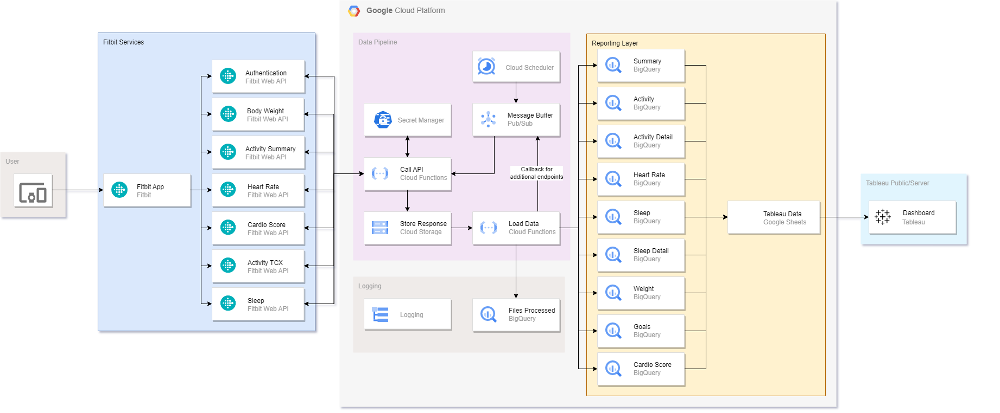

# fitbit-data-extract <!-- omit from toc -->
## Table of Contents <!-- omit from toc -->
- [Background](#background)
- [Design](#design)
- [Setup](#setup)
- [Build](#build)
- [Testing](#testing)
- [GCP Setup and Deployment](#gcp-setup-and-deployment)
- [Learnings](#learnings)
- [Future Enhancements](#future-enhancements)
## Background
Typically, my skill set has revolved around using Alteryx and SQL to build data pipelines in the past, for this project I wanted to advance my skill set in other areas. To that end this project's objective was to build a data engineering pipeline to improve my skills in python using cloud based technologies to run the code. My goal is to follow better practices when building out python code such as using github and unit testing compared to previous times where I have mostly used python within other applications.

To achieve this goal I researched several possible different APIs that I could use to be the source of the data for the project. I came to the decision that the [FitBit API](https://dev.fitbit.com/build/reference/web-api/) would work as an excellent choice as it provided Oauth authentication, several endpoints and would be useful to myself to track my own data.

To summarise I will be building a batch processed, serverless data pipeline to extract transform and load my or any users Fitbit data into a database where it can be used for reporting. 

## Design
There are several constraints for this project:
- Free tier of cloud provider
- Python based
- Serverless
- Scheduled 

I decided to go with using [Google Cloud Platform (GCP)](https://cloud.google.com/) as it provided all the needed services within its free tier outlined below.

- Messaging - [Google PubSub](https://cloud.google.com/pubsub)
- ETL processing - [Google Cloud Functions](https://cloud.google.com/functions)
- Scheduling - [Google Cloud Scheduler](https://cloud.google.com/scheduler)
- Storage - [Google Cloud Storage](https://cloud.google.com/storage)
- Database - [Google Bigquery](https://cloud.google.com/bigquery)
- Secret Storage - [Google Secret Manager](https://cloud.google.com/secret-manager)
- Logging - [Google Logging](https://cloud.google.com/logging)

Future State for reporting:
- Data Export [Google Sheets](https://www.google.com.au/sheets/about/)
- Reporting [Tableau](https://www.tableau.com/)
 *note: google sheets will be used as it can refresh on tableau public*

The general flow of how the pipeline will run is as follows:  
1. Cloud scheduler sends message to PubSub
2. PubSub Pushes message to Extract Cloud Function
3. Extract Cloud Function runs
   1. Gets Client id, secret and encryption token from Secret Manager
   2. Refreshes user token with Fitbit API
   3. Calls all end points
   4. Saves response to Cloud Storage
4. File saving on Cloud Storage triggers Transform Load Cloud Function
   1. Load file from cloud storage
   2. Transform data to standard format
   3. Load cleaned data into BigQuery
   4. Send PubSub message if any endpoints need to be called for additional data (eg details)
   5. Log file processed to BigQuery Table
5. Run steps 3-4 for additional endpoint calls 

### System Diagram <!-- omit from toc -->

## Setup
This project was developed in Visual Studio Code, with a new python virtual environment that was created to develop this locally and pytest library was installed to do unit testing. To make this quicker in future if this repo needs to be cloned to a new computer a [script](./Scripts/create_dev_env.ps1) was created that will create the environment and install all needed libraries. 

## Build
Once the environment was setup I built out code with test cases along the way, I have tried to build it in an object oriented way by building out 2 modules. [fitbit module](./Source/FitbitExtract/fitbit) that contains all the needed objects to  authenticate, call, transform and load data for this project. [helper module](./Source/FitbitExtract/helper) contains several function used to make the main function simpler and be able to reuse the code for other sections.

The first component was to build a [script](./Scripts/local_fitbit_authorise_main.py) to get the authentication token, this step is somewhat manual as it requires the user to login to Fitbit account on their website. This returns a token that the application can refresh as needed. 

The next component was to build out the [fitbit module](./Source/FitbitExtract/fitbit) this was the bulk of the time in the project and was maybe overly complex to make it more flexible and easy to modify in the future. A lot of the class methods can easily be extended to include additional endpoints with minimal modification (mostly adding in metadata and endpoint specific details).

Once the core module was completed the main function that will be run by the cloud functions needed to created. This lead me to creating a second [helper module](./Source/FitbitExtract/helper) that did all of the basic operation such as parsing the parameters sent, extracting dates and would keep the main function as simple as possible. This also was to allow for much easier testing. 

Before the cloud functions can run the BigQuery dataset and tables need to be created, using the metadata constants in the python code that define how to transform the data a SQL file can be generated by running this [script](./Scripts/create_sql_files.py). This will only generate a [SQL file](./Source/BigQuerySQL/create_tables.sql) that will then need to run in BigQuery to actually create the needed objects

The last stage is a [script](./Scripts/create_cloud_function_zip.py) that packages up all the needed file for the cloud function into a single zip for easy upload
## Testing
One of the big parts of this project was to learn how to better test python code while developing it, I used the pytest library to do this. It provided an easy way to create all the test cases and was a great introduction into. For this code it performs 118 different tests each time it is run to ensure that the code still produces the expected results.
### Coverage Report <!-- omit from toc -->

## GCP Setup and Deployment
For this project I used several different services and had to create them in GCP using the console. Some of these I created a script to help out, but many were manually created.

Created the following and enabled any services that were needed to run them. In addition to this I had to give the compute service account access to these services where it didn't have them by default.
- GCP project
- Several Storage Buckets
- PubSub Topics
- Cloud functions
- BigQuery Dataset
- BigQuery Table
- Several Secret Manger secrets

Once all the needed services and objects have been created the zip file created in the build section is uploaded into cloud functions. At this point it is ready to be run, the last step was to create a cloud schedule that sends a message to PubSub to trigger the function each day.

## Learnings
Through this project I have improved my skills in python, GCP and testings. I am sure that there are many spots where I could make improvements or there are better ways of doing it. But I think that I have made a big improvement to my python programming skills.

Some of the things I learnt from through this are: 
- Unit Testing takes a long time
- By building tests I wrote better and more flexible code 
- Testing and debugging cloud services is much harder than doing it locally
- GCP make it easy to deploy applications like this

## Future Enhancements
### Automated Deployment <!-- omit from toc -->
One of the pain points while iterating of this was that I had to manually go in and upload the zip file each time I needed to make a change to each of the cloud functions. In the future I would like to build an automated deployment pipeline using github actions that will automatically run the unit tests, then deploy the python code to GCP.
### Logging and Alerts <!-- omit from toc -->
Currently only default logging is done. In the future I would like to build in more custom logging in the cloud function code that could then be used in Alerts to better track the health of the pipeline
### Reporting <!-- omit from toc -->
The end goal of this project was to build out dashboards on this data, but due to time constraints that will be in the future using tableau.
